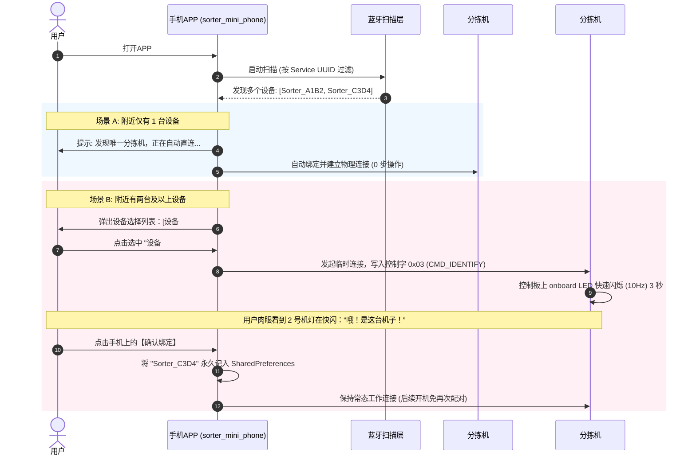

# 芦笋分拣机 — “免扫码、零打印”极简物理辨识配对方案设计书

## 1. 痛点分析与设计初衷

在上一版本的“二维码扫码一对一配对”方案中，虽然在软件上实现了物理隔离，但在**生产部署和实际使用**中存在以下繁琐的现实局限性：
1. **部署成本高**：需要每一台控制器生成专属二维码、配置打印设备、打印成不干胶贴纸，并手工粘贴到控制盒外壳上。
2. **易损易脏**：厂区环境（泥土、水分、磨损）容易使打印的二维码模糊、变脏，导致手机摄像头难以识别。
3. **用户操作冗余**：用户每次更换新手机或重置系统时，都必须拿着手机特意去寻找并对准控制盒上的二维码进行扫码。

**核心目标**：提供一种**零物理介质、免打印、免扫码、部署极其简洁**的高级配对方案。

---

## 2. “免扫码 LED 闪烁辨识” 方案概述 (Concept)

我们利用 **“手机蓝牙列表检索” + “下位机 LED 物理闪烁反馈”** 替代二维码扫码。



---

## 3. 极简用户体验流程 (User Experience)

### 场景 A：单机工作环境（90% 的普通农户场景）
* **流程**：用户通电分拣机 -> 打开手机 APP -> 手机在 3 秒内只发现了一台 `Sorter_` 外设 -> **直接进入自动连接**。
* **用户体验**：**0 步操作，插电即用**。

### 场景 B：多机并存环境（大型合作社或多条分拣线共存场景）
* **流程**：
  1. 用户通电多台分拣机 -> 打开手机 APP。
  2. APP 发现多台分拣机，在屏幕中央弹出一个极其精致的**“分拣机设备配对表”**。
  3. 用户点击列表中的任何一项（例如：`分拣机 #C3D4`），物理世界中对应的**分拣机 LED 指示灯立即以 10Hz 的频率急速闪烁 3 秒**。
  4. 用户通过肉眼观察“哪台机子在眨眼”，即可瞬间确认当前点击的是哪台机器。
  5. 确认无误后点击【确认绑定】，APP 永久记住这台分拣机，后续上电即连，不再弹出列表。
* **用户体验**：**1次点击选择 -> 1眼肉眼辨识 -> 1次确认绑定**。无需任何扫码，体验极其丝滑、极具现代科技感！

---

## 4. 技术实现细节与架构设计

### 4.1 下位机端 (esp32dev 固件层)
下位机保持轻量化状态机，配合 `BleManager` 的指令特征值进行处理：

1. **UUID 契约**：
   * 指令特征值 UUID：`3c95d5e3-d8f7-413a-bf3d-7a2e5d7be87e`
   * 新增指令控制字：**`0x03`** (定义为 `CMD_IDENTIFY` 物理识别指令)。

2. **逻辑响应**：
   * 当下位机通过蓝牙从指令特征中收到字节 `0x03` 时，触发物理识别定时器：
     ```cpp
     void BleManager::triggerIdentifyBlink() {
       _identifyEndTime = millis() + 3000; // 持续 3000 毫秒的闪烁
     }
     ```
   * 在主循环 `loop()` 中，实时读取该状态：
     ```cpp
     if (bleManager.isIdentifying()) {
       // 识别模式：10Hz 极速快闪 (50ms 翻转一次状态)
       if (millis() - lastBeat >= 50) {
         lastBeat = millis();
         digitalWrite(LED_PIN, !digitalRead(LED_PIN));
       }
     } else {
       // 正常待机模式：1Hz 慢速闪烁 (1000ms 心跳)
       if (millis() - lastBeat >= 1000) {
         lastBeat = millis();
         digitalWrite(LED_PIN, !digitalRead(LED_PIN));
       }
     }
     ```

### 4.2 手机端 (Android APP 逻辑层)

手机端的扫描匹配算法升级为**“动态发现期”**模式：

1. **发现窗口 (Discovery Window)**：
   * 启动蓝牙扫描后，进入为期 3 秒的扫描汇聚期。
   * 扫描过滤器仅根据 `SERVICE_UUID` 过滤，这样可以一次性扫描到周围所有工作的分拣机（由于它们的广播名均以 `Sorter_` 开头）。

2. **配对与持久化**：
   * **SharedPreferences 存储**：键名 `"paired_device_name"`。
   * **启动检查**：
     * 若已存有绑定名（如 `"Sorter_C3D4"`），直接启动针对该名称的**强匹配定向扫描**，秒连成功。
     * 若未绑定，启动**全局广播扫描**：
       * 若 3 秒内仅扫描到一个设备：自动执行 `pairDevice(name)` 存储并直连。
       * 若扫描到多个设备：弹窗列出，由用户点击触发 `sendCommand(0x03)`（眨眼指令），并在用户点击“绑定”后将选中的设备存入 `SharedPreferences`。

---

## 5. 方案优势对比

| 评估维度 | 二维码扫码配对方案 | 💡 LED 物理闪烁辨识配对方案 |
| :--- | :--- | :--- |
| **物理介质依赖** | ❌ 需要打印机、纸张、不干胶贴纸 | **✅ 零依赖（仅利用已有的板载 LED灯）** |
| **部署维护工作量** | ❌ 每台设备都要生成、打印、粘贴，防污防磨损 | **✅ 零工作量（出厂即支持，无需任何操作）** |
| **单机环境用户操作**| ❌ 每次重新绑定都必须对准摄像头扫码 | **✅ 0 步操作（APP 打开 2 秒内静默自动连接）** |
| **多机环境用户操作**| ⚠️ 寻找机身二维码，对准扫码（受光线限制） | **✅ 1 次点击 -> 看到指示灯闪烁 -> 点击确认绑定** |
| **硬件要求** | ⚠️ 需要手机摄像头完好、现场光线充足 | **✅ 仅依赖标准蓝牙，弱光、黑夜均能完美工作** |

---

## 6. 讨论引导与下一步决策

本方案通过将物理世界中的 **“二维码图像媒介”** 降维为 **“LED 光学视觉闪烁反馈”**，从根本上消除了硬件标签的制作与维护成本。

冯工，咱们来讨论一下：
1. **指示灯的可视性**：板载的这个 `LED_PIN` 在成品控制盒上，外部能看得到它闪烁吗？是否需要将该 LED 接到外壳的某一个发光透镜处？
2. **免扫码自动绑定的延时**：目前设定的“扫描 3 秒内若只有 1 台则自动绑定直连”的逻辑是否符合您的现场使用直觉？
